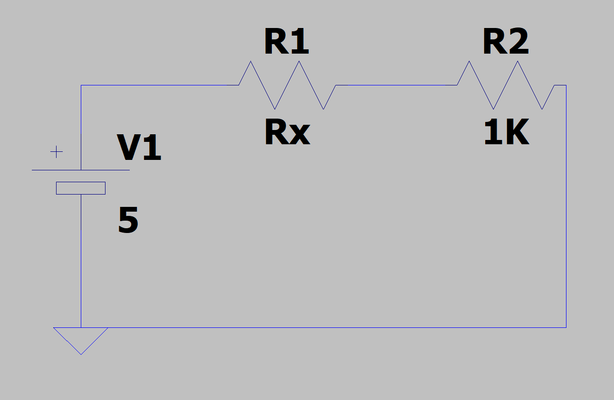

# RELAZIONE VOLTMETRO & OHMETRO

Salve a tutti, oggi relazionerò un dispositivo in grado di misurare la differenza di potenziale e la resistenza dei resistori. Cominciamo subito!

### Componenti necessari:
1. Arduino UNO R4 MINIMA
2. 3 Resistori di resistenza:
   1. 3 x 10Kohm
   2. 1Kohm
   3. 2Kohm
   4. 250ohm
3. 4 connettori femmina a banana.
4. Scatola di derivazione 150x110mm
5. 1 millefori
6. Display lcd 16x2 1602A
7. 2 pulsanti
8. 1 saldatore
9. Stagno 0.8mm
10. Spellacavi(facoltativa)

## COMINCIAMO AD ASSEMBLARE TUTTO(voltmetro):
Cominciamo subito con il voltmetro, quindi prendiamo due resistori di resistenza 10Kohm e 2Kohm, il motivo di questi valori è il seguente:
arduino è una scheda opera a 5V ciò significa che la massima tensione che possono tollerare i pin di arduino è di 5V, ma dato che il nostro voltmetro deve arrivare a massimo 30V, dovremmo occuparci di due calcoli:
```
Vmax = 30V
R1 = 10Kohm
R2 = ?

VR2 = R2 * I =>
VR2 = R2 * 30V/10Kohm+R2
5V/30V/R1+R2 = R2
(10Kohm+R2)/6 = R2
10Kohm+R2 = 6R2
10Kohm + R2 = 6R2
5R2 = 10Kohm
R2 = 2Kohm
```
Bene, adesso sappiamo i valori del nostro partitore, adesso vediamo cosa in che situazione siamo messi:


Vin sarà la tensione del nostro dispositivo che stiamo misurando, per trovarla occorre prima trovare Vout.
Per trovare Vout basterà collegare il punto di serie tra i due resistori ad uno dei pin analogici di arduino e attraverso la seguente proporzione:

```
A0 : 16383 = Vout : 5V
```
Quindi:
```
Vout = (A0*5V)/16383
```
Adesso serviranno una serie di calcoli per trovare Vin, ecco i calcoli:
```
Affermiamo che:
VR2 = Vout
VR2 = R2 * I
VR2 = R2 * Vin/R1+R2
Vin = (VR2*(R1+R2))/R2 
```
Adesso che abbiamo Vin possiamo dedicarci alla parte del circuito, per questo progetto ho usato una millefori. Iniziamo subito col inserire sulla millefori i due resistori subito dopo accendiamo il saldatore ed appena ha raggiunto la temperatura ottimale, cominciamo a depositare dello stagno sulla punta e cominciamo a riscaldare la piastra dove si trova il terminale del primo resistore appena lo stagno si comincierà a depositare piano piano, poggiamo delicatamente un pò di stagno sulla piastra così da aver coperto tutta la piastra di stagno, stessa procedura la si esegue anche sull'ultimo terminale a differenza che sta volta dovremmo unire anche il primo terminale del secondo resistore, quindi uniremo due piastre, così da averle messe in serie. Infine saldiamo l'ultimo terminale del secondo resistore. Adesso il circuito è quais pronto, ma mancano i due puntali da saldare, per questo progetto ho usato dei plug a banana femmina, così da non usare i jumper come puntali, ma ho la possibilità di usare svariati puntali:


Prima di saldare sulla millefori, saldiamo un cavo in questo plug e la parte opposta del cavo la saldiamo nella piastra dove abbiamo saldato il primo terminale del primo resistore, identica cosa facciamo con un altro plug che però andrà saldato nell'ultimo terminale del secondo resistore. Adesso saldiamo un cavo nel punto di serie dei due resistori e lo colleghiamo al pin analogico di arduino A0. Adesso tutto è pronto per il voltmetro, adesso dedichiamoci alla parte software, come mostra il codice allegato in codesto reposistory la seguente funzione:
```C
void voltmetro(){
  float r1 = 10000.0;
  float r2 = 2000.0;
  float vout = (analogRead(A0)*5.0)/16383.0;
  float vin = (vout*(r1+r2))/r2;
  lcd.print("Volt: ");
  lcd.print(vin);
  lcd.print("V");
  delay(250);
}
```
Come si vede dal codice, ho applicato le due formule che in precedenza abbiamo trovato e usato un tempo di 250ms a misura.
Adesso ci dedicheremo all'ohmetro.

## COMINCIAMO AD ASSEMBLARE IL TUTTO(ohmetro):

Per l'ohmetro il circuito cambia, perchè dovremmo usare un partitore resistivo con i seguenti dati:
1. Vin: 5V
2. R2: 1Kohm

Quindi prima di mettere mano sul circuito, facciamo due calcoli:
```
VR2 = R2 *I
VR2 = R2 * Vin/R1+R2
VR2/Vin/R1+R2 = R2
(VR2 * (R1+R2))/Vin = R2
(VR2 * (R1+R2)) = (R2 * Vin)
(R1+R2) = (R2 * Vin)/VR2
R1 = ((R2 * Vin)/VR2)- R2
```
Adesso che sappiamo il calcolo che dobbiamo fare mostriamo graficamente la nostra situazione:



Prima di continuare devo dire che l'ohmetro si base sul voltmetro, come vedete dalla formula risolutiva c'è bisogno di Vout ossia VR2 che siamo in grado di trovare mediante il codice del voltmetro.

Adesso parliamo del circuito, dobbiamo saldare sulla millefori il resistore da 1Kohm, una volta fatto dobbiamo immaginare che due cavi siano i due terminali del resistore ove la resistenze a noi è sconosciuta, in modo tale da poi appoggiare i puntali al resistore, il procedimento è lo stesso del voltmetro, si saldano i due cavi con già saldato il plug banana femmina e si saldano in due punti sulla millefori, in seguito uno di questi due punti saldati deve essere saldato con un terminale del resistore da 1Kohm, sempre su questa saldatura saldiamo un cavo che finirà sul pin analogico A1 di arduino, infine sul cavo dove non è stato saldato il punto di serie, saldiamo un cavo che parte dalla strip dei 5V, e sull'ultimo terminale del resistore da 1Kohm saldiamo un cavo che va dalla strip della massa.
Il circuito è completato!

Adesso facciamo due chiacchere sul codice:
```C
void ohmetro() {
  double r2 = 1000.0;
  double rx;
  double vin = 5.0;
  double vout = (analogRead(A1)*vin)/16383.0;
  rx = ((r2 * vin)/vout)-r2;
  lcd.print("R: ");
  delay(500);
  if (rx > 1000){
      lcd.print(rx);
      lcd.print("K");
      lcd.write(byte(0));
  }
  else{
      lcd.print(rx);
      lcd.write(byte(0)); 
  }
  delay(250);
}
```
Come vediamo il codice sembra simile al quello del voltmetro ma in aggiunta viene applicata la formula trovata poc'anzi.

## PARLIAMO DEL CODICE:
Codice: 
```C
#include <LiquidCrystal.h>
LiquidCrystal lcd(12, 11, 5, 4, 3, 2);
#define VOLT 10
#define OHM 9
#define LEN 3
byte omega[8] = {
	0b00000,
	0b00000,
	0b00000,
	0b00000,
	0b00000,
	0b01110,
	0b01010,
	0b11011
};
void setup() {
  analogReadResolution(14);     // setto al DAC 14 bit.
  pinMode(VOLT, INPUT);
  pinMode(OHM, INPUT);
  lcd.createChar(0, omega);
  lcd.begin(16, 2);
  lcd.clear();         
  lcd.print("By jim_bug :)");
  delay(500);
  lcd.clear();
  lcd.print("Scegli");
  lcd.setCursor(0, 1);
  lcd.print("la funzione: ");
  delay(1000);
  lcd.clear();
  lcd.print("Volt & Ohm");
}

void voltmetro(){
  float r1 = 10000.0;
  float r2 = 2000.0;
  float vout = (analogRead(A0)*5.0)/16383.0;
  float vin = (vout*(r1+r2))/r2;
  lcd.print("Volt: ");
  lcd.print(vin);
  lcd.print("V");
  delay(250);

}
void ohmetro() {
  double r2 = 1000.0;
  double rx;
  double vin = 5.0;
  double vout = (analogRead(A1)*vin)/16383.0;
  rx = ((r2 * vin)/vout)-r2;
  lcd.print("R: ");
  delay(500);
  if (rx > 1000){
      lcd.print(rx);
      lcd.print("K");
      lcd.write(byte(0));
  }
  else{
      lcd.print(rx);
      lcd.write(byte(0)); 
  }
  delay(250);
}

void loop(){
  
  if (digitalRead(VOLT)){
    lcd.clear();
    while (!(digitalRead(OHM))){
      lcd.setCursor(0, 0);
      voltmetro();
    }
    
  }
  if (digitalRead(OHM)){
    lcd.clear();
    while (!(digitalRead(VOLT))){
      lcd.setCursor(0, 0);todo
      ohmetro();
      lcd.clear();
    }
  }
}

```
Focalizziamoci su tre punti:
1. Prima del void setup()
2. Il void setup()
3. Il void loop()

## Punto 1:
Inanzitutto dichiaro la libreria del display, successivamente ho fatto l'istanza alla class LiquidCrystal passandogli come parametri i pin usati, ho dichiarato 2 costanti che stanno a significare i pin dei pulsanti, infine ho dichiarato un array di bit o meglio definirla matrice, per poter disegnare il simbolo ohm, il metodo usato è lo stesso delle immagini bitmap, 0=spento 1=accesso, ed ho accesso i bit che mi interessavano, poi per rendere effettivo il "carattere" ho usato una funzione di cui ne discuterò nel prossimo punto.

## Punto 2:
Questo punto è un pò il più singificativo di questo progetto, perchè proprio sulla prima riga, ho settato il Digital Analogic Converter di arduino a 14 bit, ciò significa che l'informazione che esce dai pin analogioci è a 14 BIT! ossia più precisione.
Poi ho dichiarato i pin 10 e 9(VOLT e OHM, ossia i pulsanti) come input e successivamente ho creato il carattere mediante il metodo .createChar(num, matrix), poi ho settato tutto per quanto riguarda la presentazione che avverrà all'accensione.

## Punto 3:
Qui troviamo due selezioni, la prima in pratica se il pulsante associato alla funzioen VOLT viene premuto, entrerà in un ciclo che seguirà sempre la funzione voltmetro finchè non ci saranno altri pulsanti premuti, la stessa cosa è stata applicata alla seconda selezione, tutto questo per non effettuare una misura e poi ricliccare il pulsante, in questa maniera la funzione si eseguirà finchè non si vorrà cambiare funzione.


Con questo concludo la seguente relazione, grazie alle seguenti fonti:

E grazie anche ai seguenti strumenti per la fase di testing:


