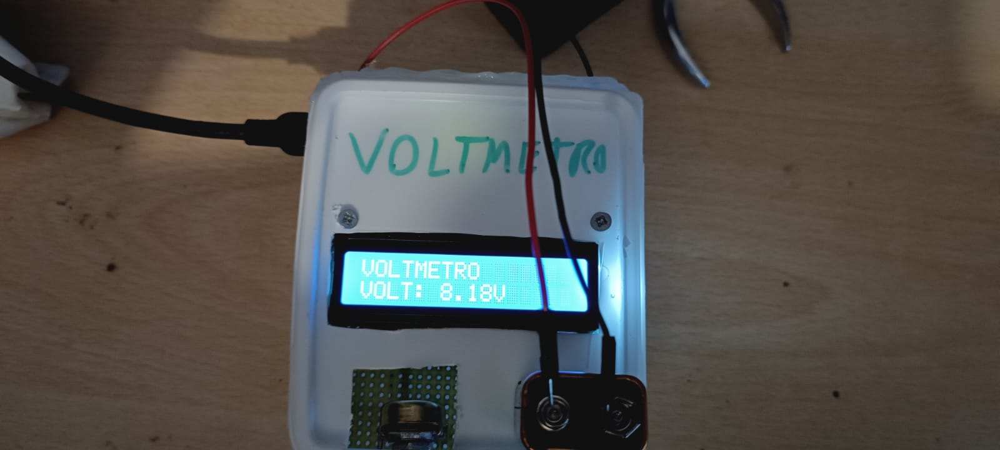

**RELAZIONE DEL VOLTMETRO CON ARDUINO DA 0-30V**

Componenti:
1. Resistore di resistenza 10Kohm.
2. Resistore di resistenza 2Kohm.
3. Potenziometro.
4. Display lcd 16x2, modulo 1602A.
5. Arduino, con microcontrollore Atmega238P.
6. Led rosso.
7. Led verde.
8. 3 Resistori di resistenza 250ohm.
9. Piezo.

Per effettuare una misura con Arduino, basta che il positivo del dispositivo lo colleghiamo ad un pin analogico e la massa del dispositivo alla massa di arduino.
Ma quello che ci limita è che i pin di arduino sopportano un massimo da 0-5V. Quindi come si fa a misurare più volt con arduino?
Basta utilizzare un partitore di tensione, dove andremo a prendere il punto di serie e lo collegheremo al pin analogico di arduino, così da fargli misurare una
tensione inferiore ad arduino, poi attraverso una formula inversa troveremo i volt previsti. Ma prima di procedere, dobbiamo trovare le resistenze dei resistori,
dato che non sono stati scelti a caso.

Per farlo dobbiamo fissare quanti volt massimi vogliamo misurare, nel nostro caso i volt massimo sono 30V, adesso scegliamo una resistenza in modo tale che non assorbi tutti
i volt misurati, nel nostro caso un resistore di resistenza 10Kohm. Per scegliere l'altra resistenza ci affidiamo ai calcoli:

Dati:
```
Vx = 30V
R1 = 10000 ohm
```

Adesso per trovare R2 utilizziamo la seguente formula:
```
Vr2 = R2 * I
```
Dove in Vr2 sostituiremo la tensione massima dei pin di arduino(5V) e per la corrente sostituiremo la sua formula:
```
5 = R2 * 30/10000+R2

5/30/10000+R2 = R2

10000+R2/6 = R2
10000 = 5R2
R2 = 2000
```

Adesso vediamo come dovrà essere strutturato il nostro partitore di tensione:


Dove Vin sarà la tensione che dovremmo misurare e Vout sarà la tensione che vedrà arduino. Quindi abbiamo risolto il problema della tensione ma adesso dobbiamo convertire
il valore del pin analogico nella vera e propria misura quindi utilizzeremo questa piccola proporzione:
```
A0 : 1023 = Vout : 5
```

Adesso che abbiamo vout per trovare Vin applichiamo una formula inversa:
```
Vout = R2 * I
Vout = R2 * Vin/R1+R2
Vout * R1 + R2 = R2 * Vin
Vin = (Vout * R1+R2)/R2
```


Prove:
Misura:


Video misura:
https://user-images.githubusercontent.com/119898897/231008000-f5f9298c-ed6f-4f7f-adf9-789bc1ed39a1.mp4

